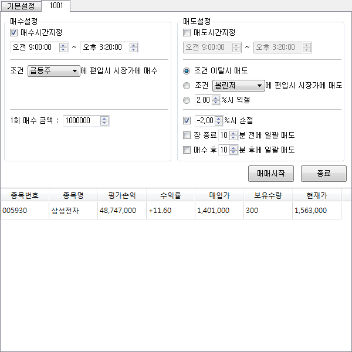

# Automated Trading System

## 목표

키움 API와 PyQt를 활용한 주식자동매매 프로그램이다. 프로그램을 실행하면 키움 API 프로그램이 같이 실행된다. 키움 API 프로그램에서 로그인을 하고 기본설정 버튼을 누르면 자신의 계좌정보가 조회된다. 자동매매 버튼을 누르면 자동매매창이 뜨며, 창을 여러개 띄워 조건을 달리하여 여러 조건으로 동시에 매매도 가능하다.

자동매매창에서는 매수 조건과 매도 조건을 설정할 수 있다. 매수시간설정을 체크하면 장이 열리는 시간부터 장이 닫히는 시간 사이에 매수를 할 시간을 지정할 수 있다. 기본적으로 실시간 조건검색을 통해 매수 종목을 결정하며 1회 매수 금액을 기준으로 매수량을 결정한다.

매도시간설정은 반대로 장이 열리는 시간부터 장이 닫히는 시간 사이에 매수를 할 시간을 지정할 수 있다. 매도 조건은 3가지로 실시간 조건검색에서 이탈할 경우 매도, 다른 실시간 조건검색에 포함된 경우 매도, 특정 수익률 이후에 익절하는 방법이 있다. 이외에도 손절을 할 수 있도록 체크박스로 수익률이 특정 값 이하로 내려가면 매도, 장이 끝나기 직전에 일괄 매도, 단타를 위해 매수 후 특정 시간이 지나면 자동으로 매도의 조건을 걸 수 있다.

아래의 리스트 박스에는 현재 보유하고 있는 종목의 종목번호, 종목명, 평가손익, 수익률, 매입가, 보유수량, 현재가가 실시간으로 조회되어 표시된다.

## License

© Youngcheor Ra